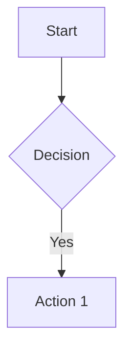

# dexterbrylle.com

Personal website and blog built with [Astro](https://astro.build).

**Live:** https://dexterbrylle.com

---

## What This Is

A fast, minimal personal site featuring:

- **Homepage** — Brief intro and latest posts
- **About** — Bio with downloadable CV
- **Blog** — Technical writing with Mermaid diagram support

Built as a static site with zero client-side JavaScript overhead. Mermaid diagrams render to SVG at build time. Styled with a clean, typography-focused design using CSS Grid backgrounds.

---

## Tech Stack

| Layer | Choice |
|-------|--------|
| Framework | Astro 5 |
| Content | Markdown + Content Collections |
| Styling | Plain CSS with CSS variables |
| Diagrams | Mermaid (server-side rendered) |
| Host | GitHub Pages + Cloudflare |

---

## Writing

Blog posts live in `src/content/blog/`. They're Markdown files with YAML frontmatter:

```markdown
---
title: "Post Title"
pubDate: 2024-01-15
---

Your content here.
```

Mermaid diagrams work inline:

````markdown

````

---

## Deployment

Pushes to `main` auto-deploy via GitHub Actions. The workflow:

1. Runs `astro check && astro build`
2. Uploads to GitHub Pages
3. Cloudflare serves from custom domain with SSL

See `.github/workflows/deploy.yml` for the full pipeline. Feature branches run CI without deploying.

---

## Structure

```
├── src/
│   ├── content/blog/       # Posts
│   ├── layouts/            # Astro layouts
│   └── pages/              # Routes
├── public/                 # Static assets, CV PDF
└── dist/                   # Build output
```

---

## License

MIT
