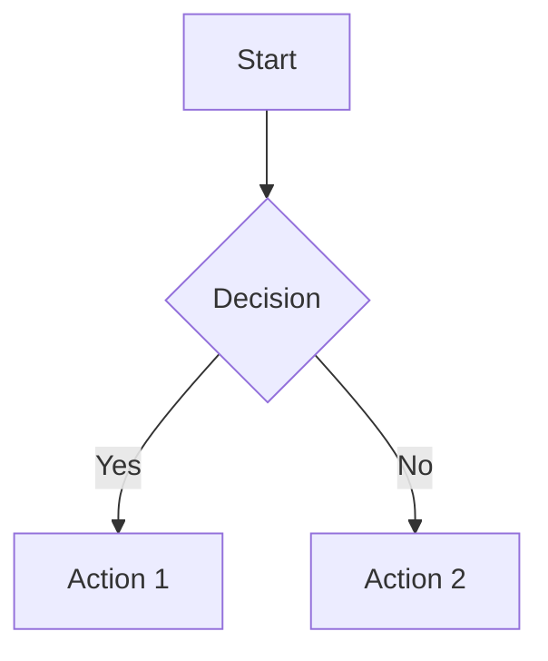

# dexterbrylle.com

Personal website built with Astro and Markdown.

## Development

```bash
# Install dependencies
npm install

# Start development server
npm run dev

# Build for production
npm run build

# Preview production build
npm run preview
```

## GitHub Pages Compatibility

✅ **Yes, this site works perfectly on GitHub Pages.** It's configured for static output (`output: "static"`), which is exactly what GitHub Pages requires. The build process generates plain HTML/CSS/JS files with no server-side dependencies.

**Key features that work on GitHub Pages:**
- All static pages (Home, About, Blog)
- Mermaid diagrams (rendered as SVG at build time)
- Custom fonts (loaded from Google Fonts CDN)
- CSS Grid background

**Note:** If using Mermaid diagrams in GitHub Actions, the workflow needs Playwright browser installation. See the deploy workflow below.

## Deploy to GitHub Pages

### 1. Create GitHub Repository

Create a new repository named `dexterbrylle.github.io` (replace `dexterbrylle` with your GitHub username).

Push your code:
```bash
git init
git add .
git commit -m "Initial commit"
git branch -M main
git remote add origin https://github.com/dexterbrylle/dexterbrylle.github.io.git
git push -u origin main
```

### 2. Configure GitHub Actions

Create `.github/workflows/deploy.yml`:

```yaml
name: Deploy to GitHub Pages

on:
  push:
    branches: [main]
  workflow_dispatch:

permissions:
  contents: read
  pages: write
  id-token: write

concurrency:
  group: "pages"
  cancel-in-progress: false

jobs:
  build:
    runs-on: ubuntu-latest
    steps:
      - name: Checkout
        uses: actions/checkout@v4

      - name: Setup Node
        uses: actions/setup-node@v4
        with:
          node-version: "20"
          cache: "npm"

      - name: Install dependencies
        run: npm ci

      - name: Install Playwright browsers
        run: npx playwright install chromium

      - name: Build site
        run: npm run build

      - name: Upload artifact
        uses: actions/upload-pages-artifact@v3
        with:
          path: ./dist

  deploy:
    environment:
      name: github-pages
      url: ${{ steps.deployment.outputs.page_url }}
    needs: build
    runs-on: ubuntu-latest
    name: Deploy
    steps:
      - name: Deploy to GitHub Pages
        id: deployment
        uses: actions/deploy-pages@v4
```

### 3. Enable GitHub Pages

1. Go to your repository on GitHub
2. Click **Settings** → **Pages**
3. Under **Source**, select **GitHub Actions**
4. The site will deploy automatically on your next push

Your site will be live at: `https://dexterbrylle.github.io`

## Connect Cloudflare Domain

### 1. Add Site to Cloudflare

1. Log into [Cloudflare Dashboard](https://dash.cloudflare.com)
2. Click **Add Site**
3. Enter your domain (e.g., `dexterbrylle.com`)
4. Select **Free** plan
5. Cloudflare will scan for existing DNS records

### 2. Update Nameservers

Cloudflare will provide two nameservers. Update them at your domain registrar:

- Remove your registrar's default nameservers
- Add Cloudflare's nameservers (e.g., `anna.ns.cloudflare.com`, `greg.ns.cloudflare.com`)

Wait 5-60 minutes for propagation.

### 3. Configure DNS for GitHub Pages

In Cloudflare DNS settings, add:

**For apex domain (`dexterbrylle.com`):**
| Type | Name | Target | TTL | Proxy Status |
|------|------|--------|-----|--------------|
| A | @ | 185.199.108.153 | Auto | DNS only |
| A | @ | 185.199.109.153 | Auto | DNS only |
| A | @ | 185.199.110.153 | Auto | DNS only |
| A | @ | 185.199.111.153 | Auto | DNS only |

**For www (`www.dexterbrylle.com`):**
| Type | Name | Target | TTL | Proxy Status |
|------|------|--------|-----|--------------|
| CNAME | www | dexterbrylle.github.io | Auto | DNS only |

> **Note:** Keep Proxy Status as "DNS only" (gray cloud) for GitHub Pages compatibility.

### 4. Add Domain to GitHub Repository

1. Go to your GitHub repository → **Settings** → **Pages**
2. Under **Custom domain**, enter: `dexterbrylle.com`
3. Click **Save**
4. Check **Enforce HTTPS** (recommended)

GitHub will create a `CNAME` file in your repository automatically.

### 5. Add CNAME to Your Repository

Create `public/CNAME` in your project:
```
dexterbrylle.com
```

This ensures the CNAME persists across builds. Commit and push:
```bash
git add public/CNAME
git commit -m "Add custom domain CNAME"
git push
```

### 6. SSL/TLS Settings in Cloudflare

1. Go to **SSL/TLS** → **Overview**
2. Set encryption mode to **Full (strict)**
3. Under **Edge Certificates**, ensure **Always Use HTTPS** is enabled

### 7. Verify Setup

1. Your site should be accessible at `https://dexterbrylle.com`
2. Check that `www.dexterbrylle.com` redirects to the apex domain (or vice versa, depending on your preference)
3. Verify HTTPS is working (green lock in browser)

## CV / Resume Setup

The About page includes a link to download your CV. To set this up:

1. Create your CV as a PDF file
2. Name it `cv-dexter-brylle.pdf` (or update the filename in `src/pages/about.astro`)
3. Place it in the `public/` directory
4. The file will be available at `/cv-dexter-brylle.pdf`

Example:
```bash
# Copy your CV to the public folder
cp ~/Documents/My-CV.pdf public/cv-dexter-brylle.pdf
```

To customize the About page content, edit `src/pages/about.astro`.

## Mermaid Diagrams

This site supports [Mermaid](https://mermaid.js.org/) diagrams in blog posts. Diagrams are rendered as static SVG at build time—no JavaScript required in the browser.

**Example usage in Markdown:**

```markdown

```

**Supported diagram types:**
- Flowcharts
- Sequence diagrams
- Entity relationship diagrams
- State diagrams
- Class diagrams
- Gantt charts
- And more...

See `src/content/blog/mermaid-diagrams.md` for a complete example.

## Project Structure

```
├── public/
│   ├── styles/
│   │   └── global.css      # Global styles & CSS variables
│   ├── CNAME               # Custom domain for GitHub Pages
│   ├── cv-dexter-brylle.pdf # Your CV file (add manually)
│   └── favicon.svg
├── src/
│   ├── content/
│   │   └── blog/           # Blog posts (Markdown)
│   ├── layouts/
│   │   └── BaseLayout.astro
│   ├── pages/
│   │   ├── index.astro     # Homepage
│   │   ├── about.astro     # About/CV page
│   │   └── blog/
│   │       ├── index.astro # Blog listing
│   │       └── [...slug].astro  # Individual posts
│   └── content.config.ts   # Content collections config
├── astro.config.mjs
└── package.json
```

## Customization

Edit CSS variables in `public/styles/global.css`:
- `--paper`: Background color
- `--ink`: Primary text color
- `--muted`: Secondary text color
- `--accent`: Link/button accent color
- `--line`: Border colors

## License

MIT
