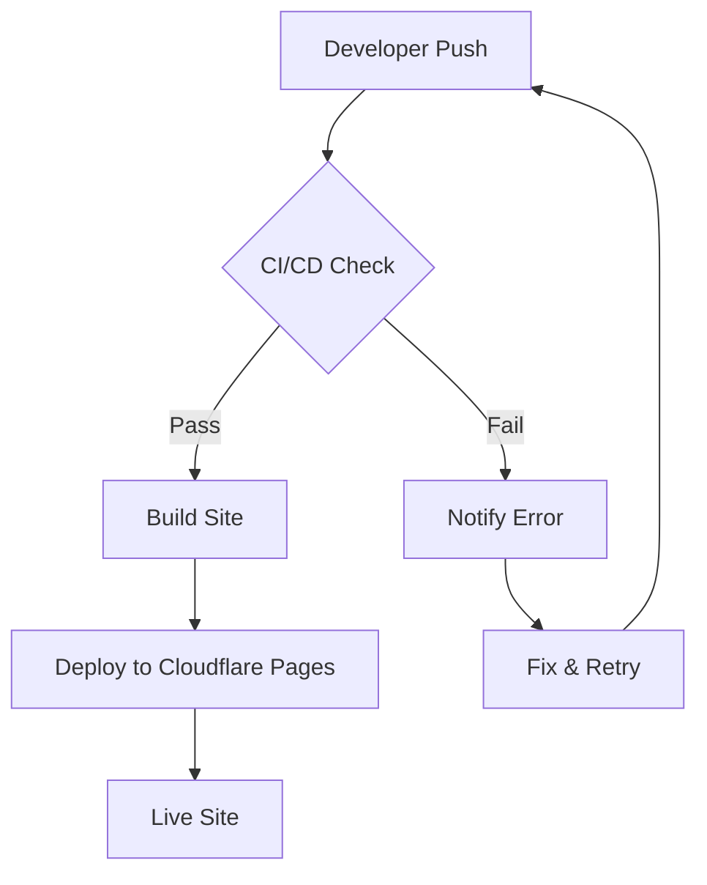
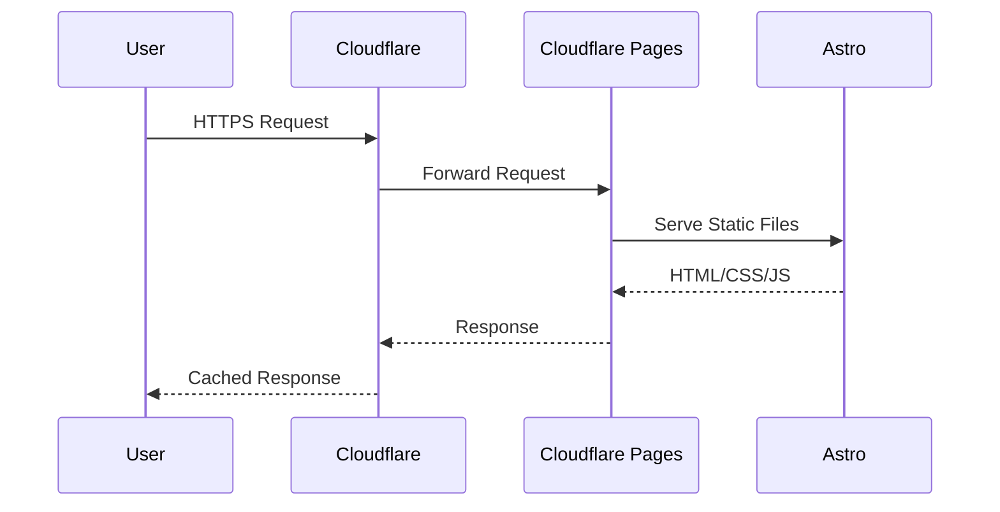
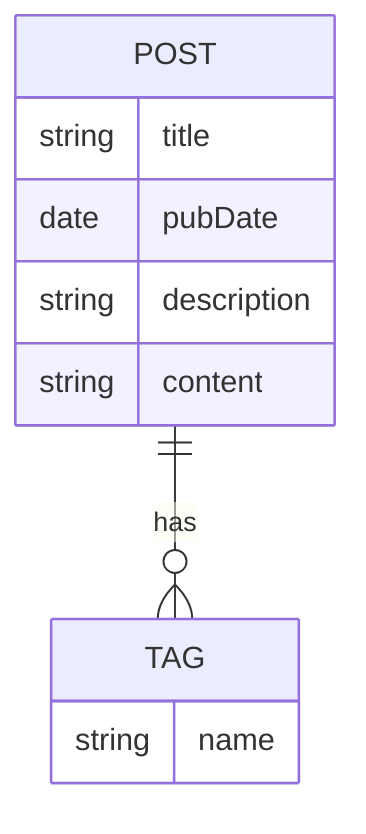

Sometimes explaining a system is easier with a diagram. I've started using Mermaid to embed diagrams directly in Markdown—no external tools, no image exports, just code that renders.

Here's how it works on this site.

## Flowcharts

A simple deployment flow:

## Sequence Diagrams

How a request flows through the stack:

## Entity Relationships

A simplified data model:

## Why This Matters

Diagrams that live as code have advantages:

- **Version controlled** – changes tracked in git
- **Diffable** – pull requests show what changed in a diagram
- **Editable** – no proprietary tools needed
- **Accessible** – renders as SVG with selectable text

Since this site uses Astro with `rehype-mermaid`, the diagrams render at build time. No JavaScript runs in the browser to draw them. The SVGs are static assets, same as the HTML.

This post itself is the proof of concept.
